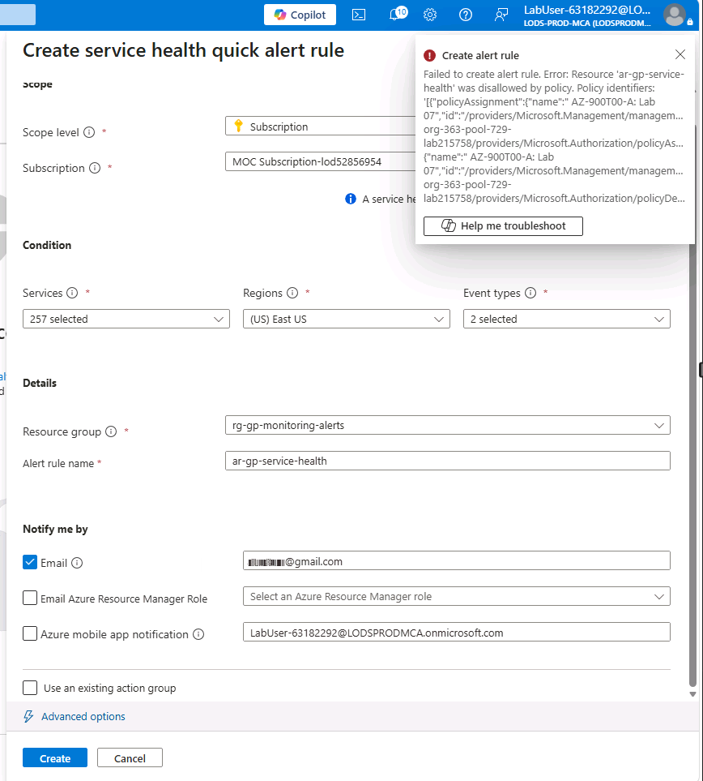

# Finding 02 — Opaque Policy-Deny Error (Lab 07)

> Written retrospectively, reconstructing a diagnosis performed in June 2026 while working through Lab 07 on the Skillable platform.

## Context

Lab 07 required creating a service health alert rule (`ar-gp-service-health`, scoped to resource group `rg-gp-monitoring-alerts`). The action failed with:

```
Failed to create alert rule. Error: Resource 'ar-gp-service-health' was disallowed by policy.
Policy identifiers: [...]
```

The error carries a policy assignment ID and a policy definition ID, but no explanation of *which condition* actually triggered the deny. The portal's built-in troubleshooting assistant returned no further detail beyond the same message.



## Reading the Policy Instead of the Error

The next step was pulling the actual policy definition referenced by the error's `policyDefinitionId`.

The relevant rule:

```json
"policyRule": {
  "if": {
    "not": {
      "anyOf": [
        {
          "allOf": [
            { "field": "type", "equals": "microsoft.insights/actiongroups" },
            { "field": "name", "equals": "ag-gp-ops-email" },
            { "field": "id", "contains": "/resourceGroups/rg-gp-monitoring-alerts/" },
            { "field": "location", "in": ["global", "eastus"] }
          ]
        }
      ]
    }
  },
  "then": { "effect": "deny" }
}
```

## Root Cause

The policy is an allowlist: anything that does not match one of the `allOf` blocks inside `anyOf` is denied. Only one `allOf` block exists, and it allowlists exactly one resource type (`microsoft.insights/actiongroups`) under one specific name (`ag-gp-ops-email`).

The resource actually being created was a different type (`microsoft.insights/activitylogalerts`) under a different name (`ar-gp-service-health`), in the same resource group — a legitimate, in-scope resource that simply had no matching branch in the allowlist. `anyOf` contained exactly one option; the resource needed a second one that was never written into the policy.

The generic error message ("disallowed by policy") is technically accurate but structurally uninformative: it reports *that* a policy fired, not *which condition inside it* was unmet — and it gives no indication of whether the resource is wrong or the policy is incomplete.

## Outcome

This was reported to Skillable support. The issue was not corrected on their end, and Lab 07 remains uncompleted as a result — it has no corresponding entry under `Labs/`.

## Conclusion

An opaque policy-deny error is diagnosed by reading the policy definition itself, not by trusting the error summary — and not by assuming the resource being created is at fault before the policy has been checked.
